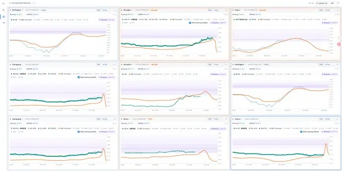
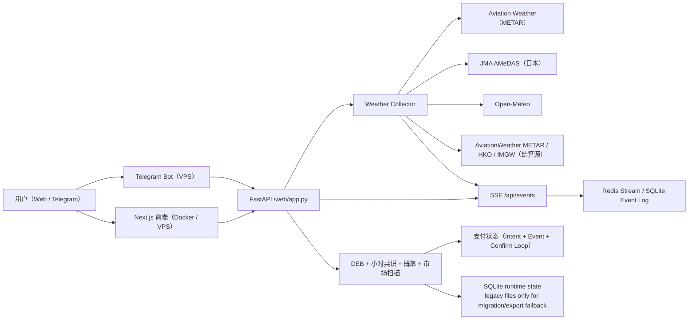

# PolyWeather Pro

面向温度结算市场的生产级气象情报系统。

官方看板：[polyweather.top](https://polyweather.top/)

## 产品截图

### 实时终端



## 当前产品状态（2026-08-16）

- 已上线 DEB 正态概率引擎：整度概率桶由 `deb_normal` 正态引擎输出。
- 已移除 WeatherNext2：Google WeatherNext2 GCS Zarr worker 下线，概率与预报基于 Open-Meteo 模型套件上的 DEB 融合。
- 已上线订阅制：`Pro 月付 29.9 USDC / 30 天`，`Pro 季度 79.9 USDC / 90 天`。
- 积分可用于支付抵扣（`500 分 = 1 USDC`，月付最多抵 `3 USDC`，季度最多抵 `8 USDC`）。真实、有上下文、有价值的用户反馈也可通过运营后台人工奖励积分。
- 已上线链上支付：Polygon 合约支付（USDC / USDC.e）+ Ethereum 主网 USDC 直转确认。
- 已上线自动补单：事件监听 + 周期确认双链路。
- 已上线支付运行态与审计接口：`/api/payments/runtime`。
- 已上线轻量运营后台：`/ops`（会员、用户反馈处理、积分、补分、支付异常单）。
- 轻量可观测性：`/healthz`、`/api/system/status`、`/api/system/cache-status`、`/api/system/priority-warm`、`/metrics`（ops 鉴权）+ `scripts/check_ops_health.py` 巡检（14 个外部服务探测）。
- 已上线预测 API：`/api/cities/deb-forecast` 输出 DEB 预测 + 多模型 3 天日报，默认 24 城监控清单（entitlement token 鉴权），结果缓存 5 分钟秒回；registry 全量 51 城，深圳结算为宝安机场 ZGSZ METAR。
- 终端图表支持 3 天（72h）窗口：观测 / 模型共识 median-min-max / DEB 锚点；x 轴每 6 小时刻度 + 午夜日期标记。
- 机场 METAR 报文曲线已全部移除（用户需求）：仅保留结算源、官方增强网络（JMA / HKO）与 TAF 信号曲线；MGM（土耳其）数据源已整套下线，安卡拉/伊斯坦布尔回归 METAR 结算。
- DEB 校准改进：温度段独立 σ（≥37°C cov90 0.820→0.893）、城市偏差近 14 天加权（模式切换 2 周收敛）、推理校正上限 3→5°C（7 月高估 4-6°C 不再截断）。
- 终端新用户三步引导（实况锚点 → DEB → 市场概率）；落地页与图片体积优化（Load 7.7s → 4.4s）。
- 支付地址白名单拆分：合约模式校验新合约 `0x1fD90A`、manual 模式校验直转 EOA `0x351a1bca`。
- 实时终端已切换到可重放事件流：可见城市图表通过 `/api/events?cities=...&since_revision=...` 订阅 `city_observation_patch.v1`，生产环境使用 Redis Stream 做短窗口 replay，本地/单进程可回退 SQLite event log。
- 图表刷新由实测事件驱动：SSE patch 直接合并到当前曲线，不弹 loading 遮罩；只有可见图表启用 60 秒无 patch 兜底，浏览器后台返回前台时会主动补齐最新 detail。
- 城市图表默认展示“全天”，可选“高温”窗口由 DEB hourly path 推导；所有图表横轴都按城市当地时间展示，不按用户浏览器时区。
- 核心图表组件已拆分为逻辑、状态与 canvas 渲染模块；Recharts 使用 `ResizeObserver` 后的明确宽高，规避 0x0 渲染和长时间挂页后曲线消失。
- DEB hourly consensus（`deb_hourly_consensus.v1`）已作为峰值窗口和图表 DEB 曲线的优先小时路径；DEB 仍然是预测曲线，不作为实测来源。
- 概率主引擎已切换为 DEB 正态引擎（`deb_normal`，整度概率 `P(T==τ)=Φ((τ+0.5-μ)/σ)-Φ((τ-0.5-μ)/σ)`）；legacy 高斯概率不再占用默认温度图主视图，保留为回退分支，hover tooltip 展示 `Gaussian μ` 和完整温度区间概率分布。
- 结算源优先的机场实测默认展示并高亮，官方邻近站网作为弱化曲线保留；釜山单跑道只展示 `SR/SL` 结算跑道，不再重复显示聚合线。
- 香港默认展示 CoWIN `6087`（保良局陈守仁小学）1 分钟参考站曲线，HKO 10 分钟实测保留为官方气象层。
- 运行态状态、缓存与核心离线训练/回填链路已完成 SQLite 主路径收口；legacy JSON/JSONL 仅保留给迁移、导出与显式回退输入。
- 官方增强站网已统一接入：
  - `JMA AMeDAS`（日本）
  - `HKO`（香港）
- 数据源已清理：Wunderground、台北 `CWA`、中国跑道 `AMSC AWOS`、中国内地 `NMC/CMA` 均已移除；深圳结算源切换为宝安机场 `ZGSZ` METAR（流浮山 LFS 结算已下线）。
- 东京现已接入羽田 `JMA AMeDAS` 10 分钟温度作为官方增强层。
- 已支持 Dashboard 定向预热 worker / cron 路径，运行态在 `/api/system/status` 与 `/ops` 可见。
- `/ops` 现已展示缓存桶数量、summary cache hit/miss 与运行态 heartbeat。
- 今日日内分析已改为“专业气象判断台”：顶部先给气象主判断、置信度、基准/上修/下修路径、下一观测点，再展示证据链、失效条件、确认条件和模型层。
- 日内分析弹窗在 full detail / market detail 同步完成前会锁住旧内容并显示刷新状态，避免用户短暂看到上一轮缓存数据后误判。
- 终端图表/详情工作流已改为结构化实况 + DEB hourly consensus + 多模型集群 + 概率分布 tooltip + 市场温度桶，不再让图表等待 AI 文案生成。
- 终端数据同时使用页面内存缓存、浏览器 `localStorage`、后端短 TTL 缓存、SSE patch replay 和前台恢复刷新；从其他选项卡切回时会优先恢复最新可见图表状态。
- 市场温度桶匹配已改为完整 `all_buckets` 映射，按 exact / range / or higher / or lower 方向严格匹配，避免把天气中枢错配到不合理尾部桶。
- 市场信号中的“模型-市场差”口径为 `模型概率 - 市场隐含概率`，正值表示天气概率高于市场报价，负值表示市场已经更充分计价。
- 概率区已改为“校准模型概率”；默认展示 DEB 正态概率引擎（`deb_normal`）输出，legacy 高斯作为回退分支，模型共识作为辅助参考。
- 今日日内结构解读以规则与结构化信号为主，AI 文案只作为可降级辅助层，不替代实测、DEB、TAF 或结算逻辑。
- 前端设计系统全面重构：统一 CSS token 体系、消除 !important 滥用（134→49）、合并断点（18→10）、数百处硬编码颜色迁移至 CSS 变量、添加 ARIA 无障碍属性和键盘导航。完整审查记录见 `docs/reviews/frontend-ui-design-review.md`。

## 许可证与商用边界（重要）

本仓库自 `2026-03-30` 起采用 **GNU AGPL-3.0-only**。

- 仓库公开部分：天气聚合、基础分析、前端看板、Bot 基础能力、标准支付流程。
- 不包含在仓库中的部分：生产私有数据、商业风控规则、运营阈值、收费策略细节、内部对账与增长工具、内部错价策略、仓位规则与交易 Bot 执行代码。
- 商标、品牌、域名、生产数据库与托管服务运营能力，不因代码许可证一并授权。

详细见：[商业化与开源边界](docs/COMMERCIALIZATION.md)

## 核心能力

- 聚合 51 个监控城市的实测与预报数据。
- DEB（Dynamic Error Balancing）融合多模型最高温。
- 构建 DEB 加权小时共识曲线，用于峰值窗口判断和图表默认 DEB 展示。
- 输出结算导向校准概率分布（`mu` + 温度桶），主路径为 DEB 正态引擎（`deb_normal`），legacy 高斯校准保留为回退。
- 天气决策台把结构化实况、DEB 高温路径、完整市场温度桶和模型-市场差放进图表/详情工作流。
- 图表 tooltip 展示校准高斯上下文：`mu` 加完整温度区间概率分布，不把概率温度带重新放回主图。
- Web 仪表盘与 Telegram Bot 复用同一分析内核。
- 支付链路具备事件重放、SQLite 审计事件与 RPC 容灾能力。
- 已上线站内反馈闭环：提交反馈时自动附带图表上下文，用户可查看处理状态，运营后台可为有价值反馈人工奖励积分。
- 官方增强层支持按国家 provider 统一接入，不替代机场主站、METAR 或明确官方结算站。

## 参考架构



## 监控城市（51）

- 欧洲/中东/非洲：Ankara、Istanbul、Moscow、London、Paris、Munich、Milan、Warsaw、Madrid、Tel Aviv、Amsterdam、Helsinki、Cape Town、Jeddah
- 亚太：Seoul、Busan、Hong Kong、Taipei、Shanghai、Beijing、Wuhan、Chengdu、Chongqing、Shenzhen（宝安 ZGSZ METAR）、Guangzhou、Jinan、Zhengzhou、Singapore、Tokyo、Kuala Lumpur、Manila、Wellington
- 美洲：Toronto、New York、Los Angeles、San Francisco、Denver（Aurora/Buckley KBKF）、Austin、Houston、Chicago、Dallas、Miami、Atlanta、Seattle、Mexico City、Buenos Aires、Sao Paulo、Panama City
- 南亚：Lucknow、Karachi

## 快速启动

### 后端 + Bot（Docker）

```bash
docker compose up -d --build
```

### 前端本地运行

```bash
cd frontend
npm ci
npm run dev
```

## 近期更新

- 概率主引擎为 DEB 正态引擎（`deb_normal`）。
- 预测 API 已上线（`/api/cities/deb-forecast`，结果缓存 5 分钟）。
- 机场 METAR 报文曲线全部移除；WeatherNext2 已移除；Telegram 群依赖与积分邀请机制已下线。
- 数据源清理：Wunderground、台北 CWA、AMSC AWOS（中国跑道）、NMC/CMA（中国内地）与流浮山 LFS 结算已移除；深圳结算切换为宝安 ZGSZ METAR；NOAA 结算源切为免费 aviationweather METAR。
- DEB 校准：温度段独立 σ、近 14 天加权城市偏差、推理校正上限 3→5°C。
- 服务端稳定性：SQLite 18.9GB → 2GB（队列/观测/快照清理 + VACUUM）、`load_history` 缓存、预测 API 事件循环安全。
- 高斯概率 tooltip 已改为展示完整温度区间概率分布，不再只显示最高概率的单个区间；主图继续聚焦实测和预测曲线。
- 用户反馈已形成产品闭环：终端提交会自动附带图表上下文，用户可在站内查看处理状态，运营侧可为真实、有建设性的反馈发放积分奖励。

## 运行数据目录（VPS 推荐）

建议将运行态数据放到仓库外（避免 `git pull` 被 SQLite 卡住）：

```env
POLYWEATHER_RUNTIME_DATA_DIR=/var/lib/polyweather
POLYWEATHER_DB_PATH=/var/lib/polyweather/polyweather.db
POLYWEATHER_STATE_STORAGE_MODE=sqlite
POLYWEATHER_EVENT_STORE=redis
POLYWEATHER_REDIS_URL=redis://polyweather_redis:6379/0
POLYWEATHER_REDIS_STREAM_MAXLEN=50000
POLYWEATHER_REDIS_REQUIRED=true
```

本地开发或严格单进程兜底可使用 `POLYWEATHER_EVENT_STORE=sqlite`。

## 运维验收

### 健康与系统状态

```bash
curl http://127.0.0.1:8000/healthz
curl http://127.0.0.1:8000/api/system/status
curl http://127.0.0.1:8000/metrics
```

### 前端缓存验证

```bash
./scripts/validate_frontend_cache.sh "https://polyweather.top"
```

### 支付自动补单日志

```bash
docker compose logs -f polyweather | egrep "payment event loop started|payment confirm loop started|payment auto-confirmed"
```

### 手动巡检

```bash
python scripts/check_ops_health.py --base-url http://127.0.0.1:8000
```

### 支付运行态

```bash
curl http://127.0.0.1:8000/api/payments/runtime
```

### 运营后台

- 前端入口：`https://polyweather.top/ops`
- 后端需配置：

```env
POLYWEATHER_OPS_ADMIN_EMAILS=yhrsc30@gmail.com
```

## Telegram 指令

| 指令 | 用途 |
| :-- | :-- |
| `/top` | 用户积分排行 |
| `/id` | 查看聊天 Chat ID |
| `/diag` | Bot 启动诊断 |
| `/help` | 帮助与用法 |

## 文档索引

- 英文总览：[README.md](README.md)
- API 文档（中文）：[docs/API_ZH.md](docs/API_ZH.md)
- 商业化与开源边界：[docs/COMMERCIALIZATION.md](docs/COMMERCIALIZATION.md)
- Supabase 接入：[docs/SUPABASE_SETUP_ZH.md](docs/SUPABASE_SETUP_ZH.md)
- 配置与密钥管理：[docs/CONFIGURATION_ZH.md](docs/CONFIGURATION_ZH.md)
- 前端部署（Docker / VPS）：[docs/FRONTEND_DEPLOYMENT_ZH.md](docs/FRONTEND_DEPLOYMENT_ZH.md)
- 技术债：[docs/TECH_DEBT_ZH.md](docs/TECH_DEBT_ZH.md)
- 数据源总览（含机场高频）：[docs/DATA_SOURCES_ZH.md](docs/DATA_SOURCES_ZH.md)
- 运维手册（外部服务 / 运营后台 / 监控）：[docs/OPS_ZH.md](docs/OPS_ZH.md)
- 支付合约验证：[docs/payments/POLYGONSCAN_VERIFY.md](docs/payments/POLYGONSCAN_VERIFY.md)
- 支付审计说明：[docs/payments/PAYMENT_AUDIT_ZH.md](docs/payments/PAYMENT_AUDIT_ZH.md)
- 支付 V2 升级方案：[docs/payments/PAYMENT_UPGRADE_V2_ZH.md](docs/payments/PAYMENT_UPGRADE_V2_ZH.md)
- 设计/产品/数据评审归档：[docs/reviews/](docs/reviews/)
- DEB 模型家族去重规则：[docs/MODEL_STACK_AND_DEB_ZH.md](docs/MODEL_STACK_AND_DEB_ZH.md)
- 深度评估报告：[docs/reviews/deep-research-report.md](docs/reviews/deep-research-report.md)
- 发布流程：[RELEASE.md](RELEASE.md)
- 变更记录：[CHANGELOG.md](CHANGELOG.md)

## 当前版本

- 版本：`v1.8.1`（版本源文件；文档已为即将发布的 `v1.9.0` 刷新）
- 文档最后更新：`2026-08-01`
