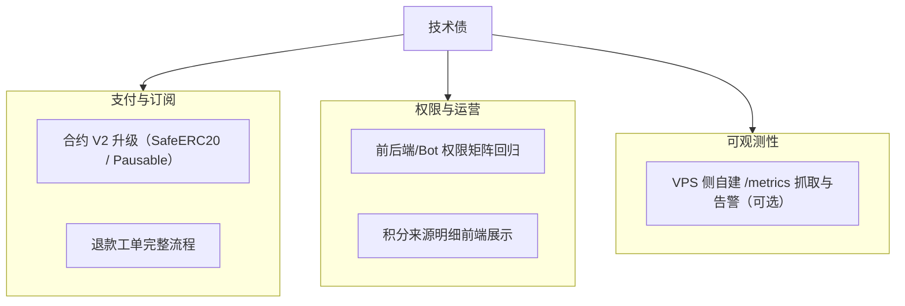

# 技术债与工程待办（v1.9.0）

最后更新：`2026-08-01`

目标：在收费上线后，优先保证状态一致性、支付可靠性、可观测性和概率引擎发布可控。

## 1. 债务快照

当前估计：**97% 稳定 / 3% 技术债**。前端设计系统债务已在 v1.6.0 全面消除，监控栈已在 v1.9.0 收敛为轻量链路。

## 2. 近期已关闭

- **前端设计系统工程债务（2026-05-10）**：消除 !important 滥用（134→49）、统一断点体系（18→10）、数百处硬编码颜色迁移至 CSS 变量、修复 accent-green 蓝色 Bug、添加 ARIA 无障碍属性、去重 @keyframes、移除死代码（1,697 行）。详见 `docs/frontend-ui-design-review.md`。
- 支付主链路已上线（intent -> submit -> confirm）。
- 支付自动补单已上线（Event Loop + Confirm Loop，循环参数可配置）。
- 支付事件重放脚本已补齐。
- 支付运行态 API 与 SQLite 审计事件已补齐。
- 钱包绑定支持浏览器钱包 + WalletConnect。
- 账户中心与 Pro 权限展示链路打通。
- 运行态状态/缓存与核心离线训练、评估、回填链路已完成 SQLite 主路径收口。
- 轻量可观测性已上线（`/healthz`、`/api/system/status`、`/api/system/cache-status`、`/api/system/priority-warm`、`/metrics` + `scripts/check_ops_health.py`）。
- **WeatherNext2 接入（2026-08-01）**：GCS Zarr 6h worker + LightGBM 校准 q10/q50/q90 分位，终端侧边栏第 3 项展示。
- **套利对比上线（2026-08-01）**：`/api/arbitrage/overview` 与 `/overview-batch` 全城市批量概览，终端侧边栏第 5 项展示。
- **DEB 正态概率引擎（2026-08-01）**：`deb_normal` 取代 legacy 高斯分桶成为主概率路径，legacy 保留为回退分支。
- **训练结算服务（2026-08-01）**：`training_settlement` 服务（6h 周期、回看 10 天）与领域仓库重构（`src/database/repos/`）。
- **数据源清理（2026-08-01）**：移除 Wunderground、台北 CWA、AMSC AWOS、NMC/CMA；深圳改挂流浮山 HKO（LFS）；结算源收敛为 NOAA Synoptic（11 城）+ HKO（2 城）+ IMGW（可选）；TAF 唯一来源 NOAA AviationWeather。
- **监控栈收敛（2026-08-01）**：移除 Prometheus / Alertmanager / Alert Relay / Grafana 四组件与 `monitoring/` 目录，监控收敛为 FastAPI 轻量端点 + 巡检脚本。

## 3. 高优先级技术债

| 项目 | 影响 | 建议动作 |
| :-- | :-- | :-- |
| 退款与售后链路 | 商业闭环不完整 | 基于现有 `/api/ops/refunds` 端点补齐工单状态机与前端入口 |

## 4. 中优先级技术债

| 项目 | 影响 | 建议动作 |
| :-- | :-- | :-- |
| 积分发放可解释性 | 用户理解成本高 | 输出积分来源明细前端展示（群发言/有效付费邀请/后台人工补发/积分抵扣消费） |
| 支付合约 V2 升级 | 当前仍是最小可用合约 | 升级到 SafeERC20 + Pausable + plan 绑定 |
| 支付失败文案标准化 | 转化率受影响 | 建立错误码 -> 文案映射表 |

## 5. 低优先级技术债

| 项目 | 影响 | 建议动作 |
| :-- | :-- | :-- |
| 前端离线缓存能力 | 非核心 | 评估 Service Worker + IndexedDB |
| 冷启动波动 | 首屏抖动 | 热点城市预热（`/api/system/priority-warm` 已提供手动触发入口） |
| VPS 侧指标抓取 | 轻量端点已够用 | 如需趋势面板，可在 VPS 自建 Prometheus 抓取 `/metrics`（后端无需改动） |

## 6. 下阶段里程碑

1. 评估并推进支付合约 V2 升级。
2. 补齐退款工单状态机与前端入口。
3. 积分来源明细前端展示。
